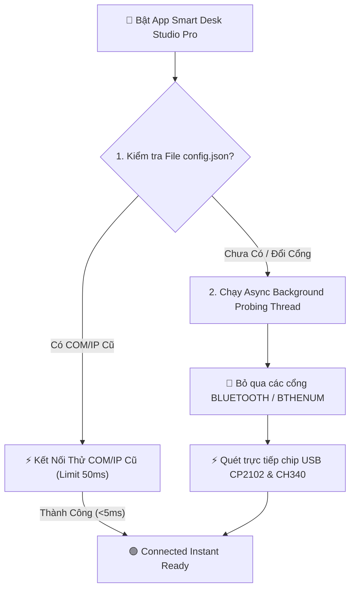

# 👑 TÀI LIỆU CHIẾN LƯỢC DỰ ÁN THƯƠNG MẠI SMART DESK STUDIO PRO
*(Commercial Product Roadmap, UX Strategy & Ultra-Fast Architecture)*

Tài liệu này lưu trữ toàn bộ tầm nhìn sản phẩm thương mại, các giải pháp kỹ thuật tối ưu và định hướng phát triển cho dự án **ESP32 CYD Smart Desk Studio Pro**.

---

## 🌟 1. ĐỊNH HƯỚNG TẦM NHÌN SẢN PHẨM (PRODUCT VISION & WOW FACTOR)

Sản phẩm thương mại hướng tới trải nghiệm **"WOW ngay từ lần đầu mở hộp"** dành cho khách hàng:

1. **📦 Hoàn Thiện Từng Chi Tiết Phần Cứng (Hardware Elegance)**:
   - Đóng gói vỏ Case 3D/Mica nhám cao cấp, viền mỏng, chân đế nghiêng nam châm.
   - Tích hợp dải đèn **LED RGB Ambient Backlight hắt tường** mặt sau (đổi màu theo thời tiết, nháy theo nhạc).
2. **🚀 Khởi Động Phần Mềm PC 0ms (Instant Startup)**:
   - Bật ứng dụng PC lên là giao diện hiển thị ngay lập tức, không có độ trễ UI.
3. **🟢 Kết Nối Tự Động Siêu Tốc < 50ms**:
   - Nhận diện tức thì cả USB Serial lẫn WiFi LAN mà không làm treo ứng dụng.
4. **⚡ 1-Click Live Sync**:
   - Nhấn nút Sync trên PC, chiếc đồng hồ trên bàn lập tức nhảy giao diện mới sau `< 0.2s`.

---

## ⚡ 2. THUẬT TOÁN TỐI ƯU KẾT NỐI SIÊU TỐC (< 50ms)

### 🔍 Khắc Phục Lỗi Kết Nối Chậm Ở Dự Án Cũ:
- **Bệnh 1**: Treo do quét tất cả các cổng Bluetooth COM ảo trên Windows (mỗi cổng bị treo 2-3s).
- **Bệnh 2**: Treo do phân giải tên miền mDNS `cyd-dashboard.local` khi không có WiFi.

### 🛡️ Thuật Toán Kết Nối Tối ƯU MỚI:

1. **Cache-First Fast Reconnect (5ms)**: Lưu cổng COM & IP thành công gần nhất. Kết nối thử cổng cũ này trước tiên. 99% trường hợp kết nối thành công chỉ trong 5 millisecond!
2. **Instant Bluetooth Filtering**: Skip lập tức các cổng COM có chuỗi `BLUETOOTH`, `BTHENUM`.
3. **Async Multi-Threading**: Đưa việc quét mạng và USB Serial vào luồng ngầm (`threading.Thread`).

---

## 🔄 3. CƠ CHẾ ĐỒNG BỘ 2 CHIỀU TUYỆT ĐỐI (2-WAY BIDIRECTIONAL SYNC)

- **Chiều PC $\rightarrow$ CYD**: Nhấp kéo đối tượng trên PC $\rightarrow$ Màn hình CYD đổi giao diện sau `< 0.2s`.
- **Chiều CYD $\rightarrow$ PC**: Người dùng chạm cảm ứng chuyển trang trên CYD (Page 0 $\rightarrow$ Page 2) $\rightarrow$ CYD gửi sự kiện về PC $\rightarrow$ **App PC tự động chuyển Tab sang Page 2 tương ứng**!

---

## 🎯 4. MÔ HÌNH KINH DOANH & CHỢ SKIN (SKIN MARKETPLACE)

### 📊 A. Phân Khúc Nhóm Khách Hàng (User Profile Suites):
1. **Trader & Financial Investor**: Giá Vàng SJC, XAU/USD, Giá Bạc, Chứng khoán VN-Index, Crypto Ticker (BTC/ETH). Đèn nháy cảnh báo biến động giá.
2. **Gamer & Overclocker**: Tải CPU%, RAM%, GPU%, Temp, FPS game.
3. **Office & Productivity**: Lịch âm dương xem ngày tốt xấu, Pomodoro timer, To-Do list.
4. **Streamer & Music Enthusiast**: Album Art Spotify & Dynamic Audio Visualizer.

### 💎 B. Mô Hình Doanh Thu Chợ Skin (Monetization):
- **🆓 Free Tier**: 4 Presets cài sẵn + Công cụ kéo thả thiết kế skin trên PC.
- **🛍️ Premium Store (19k - 49k/Skin)**: Skin thiết kế Pixel Art Anime, 3D HUD cao cấp.
- **🎨 Creator Share 70/30**: Designer đăng bán skin thu 70%, nhà sản xuất giữ 30%.
- **📡 VIP Data Feed (29k/tháng)**: Luồng dữ liệu Chứng Khoán VN-Index & Giá Vàng SJC tự động.

---

## 📅 LỘ TRÌNH THI CÔNG HOÀN THIỆN (EXECUTION PLAN)

| Bước | Hạng Mục Công Việc |
| :---: | :--- |
| **Bước 1** | Áp dụng thuật toán kết nối siêu tốc (< 50ms) vào `pc_utility/pc_monitor_app/main.py`. |
| **Bước 2** | Nâng cấp giao diện Studio Kéo Thả `skin_designer_studio/main.py`: Toolbar Nổi Nhanh, Hít Lưới Snap Alignment, Color Palette Swatches. |
| **Bước 3** | Viết module C++ `DynamicSkinManager` trên ESP32 CYD để tiếp nhận và lưu Skin JSON vào Flash LittleFS. |
| **Bước 4** | Đóng gói bộ cài đặt `SmartDeskStudioPro_Setup.exe` thương mại hóa hoàn chỉnh. |
